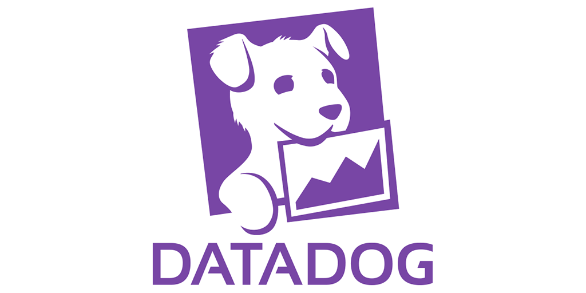

To collect metrics from BOSH-deployed machines, I packaged a BOSH release of the [Datadog](https://www.datadoghq.com) agent.

We already used [BOSH](http://bosh.io) to deploy distributed systems like Elasticsearch, so when we switched our metrics provider to Datadog, we needed to install the agent on our BOSH-deployed machines.
Writing a BOSH release is how software is packaged for BOSH, so I broke down the automated setup for the Linux agent and re-automated it in the packaging script.

I added configuration support for a few useful features, like AWS tags and agent integrations.

I took a small shortcut and used the Ubuntu python packages instead of re-packaging python.
I may revisit that choice when BOSH supports sharing packages between releases.
