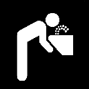
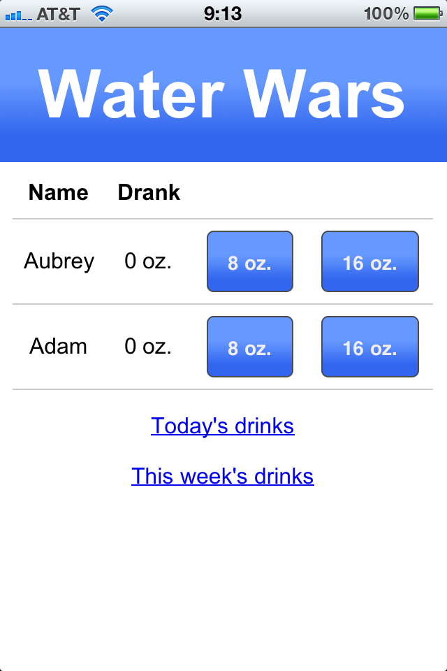

[Water Wars](http://water-wars.adamstegman.com/) is a web application I wrote in Angular backed by Firebase (originally in Ruby on Rails) to track water consumption for my wife and me.

It allows us to see how the other is doing that day at a glance, while quickly adding our own consumption.

We can also compete on weekly totals.

